

## Project is Live @ https://prompts-book.vercel.app/

### Email: anuplohar001@gmail.com   Password: pass@123

### A feature-rich web application for exploring, creating, and interacting with AI-generated prompts. PromptsBook includes real-time chat, user authentication, and comprehensive features to manage and share prompts.

- ✍️ **Create, edit, and delete prompts**
- ❤️ **Like and comment on your favorite prompts**
- 📚 **Categorized prompts for easy browsing**
- 🧠 **Explore AI-generated suggestions**
- 🔐 **Secure authentication and authorization**
- 📈 **Modern, responsive UI built with Next.js & Tailwind CSS**

## 🛠️ Tech Stack

**Frontend:**  
- Next.js  
- Tailwind CSS  
- React Redux  

**Backend:**  
- Node.js  
- Express.js  
- MongoDB (with Mongoose)  
- Next API Routes  

**Authentication:**  
- NextAuth.js  

**Version Control:**  
- Git & GitHub

---

### Table of Contents

- [Features](##Features)
- [Technologies Used](#technologies-used)
- [Installation](#installation)

## Features

**User Authentication:** Secure login/signup with Credentials and Google Provider.

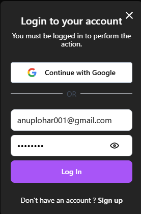 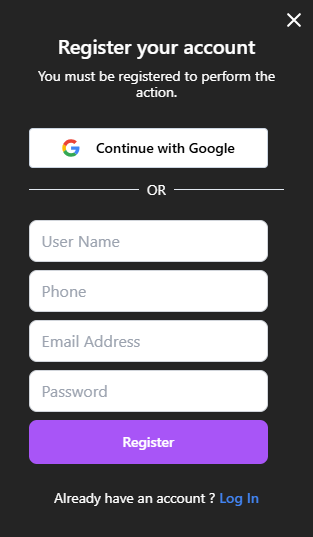

**Home Page** Explore trending AI prompts and categories.

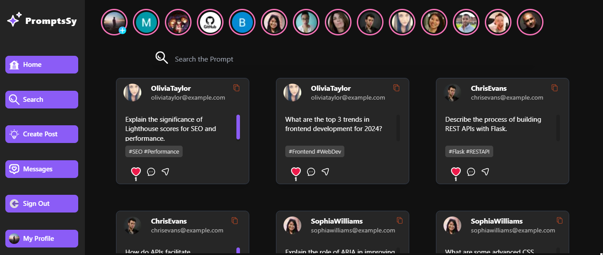

**User Profile Page** Explore User Profiles includes their posts.

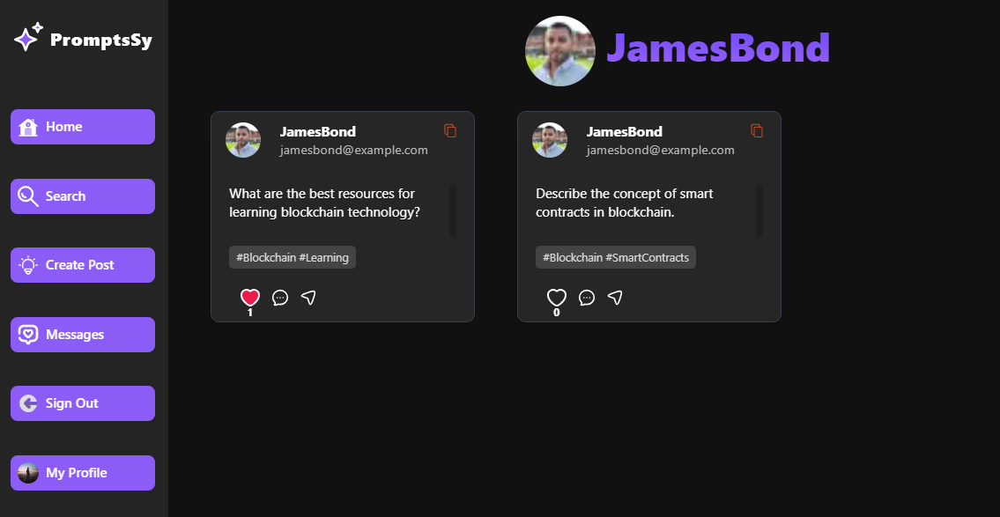

**Prompt Management:** Create, update, delete, and share prompts.
Create Post

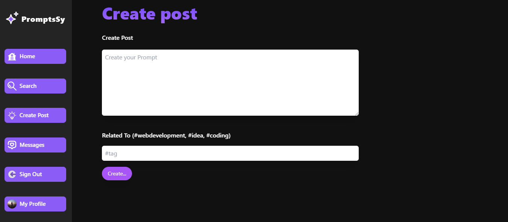

Manage My Profile

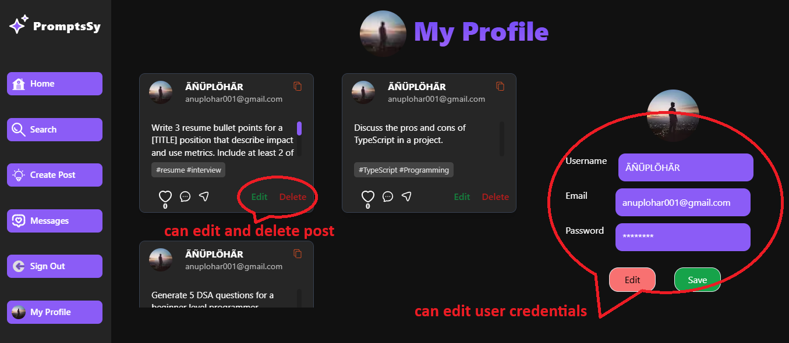

Edit Post

Share Posts

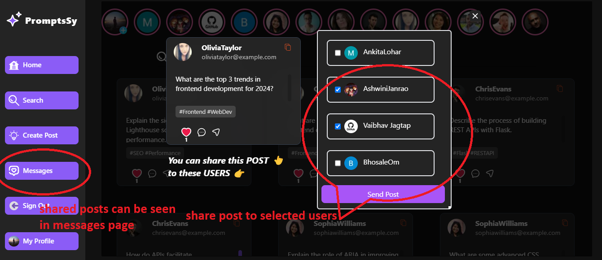

**Interactive Chat App:** Real-time chat functionality for users.

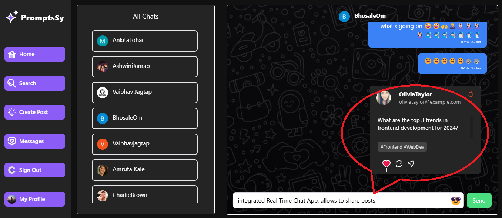

**Stories Feature:** Share stories with AI prompts.

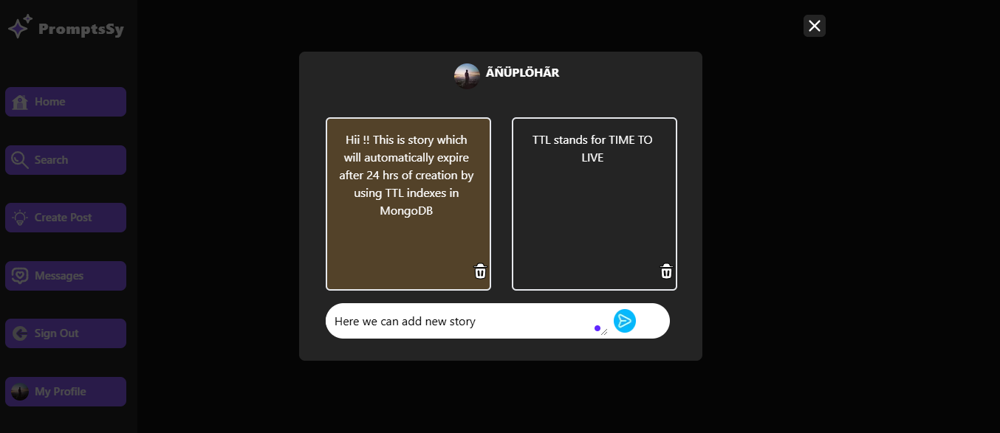

**Like and Comment System:** Engage with prompts through likes and comments.

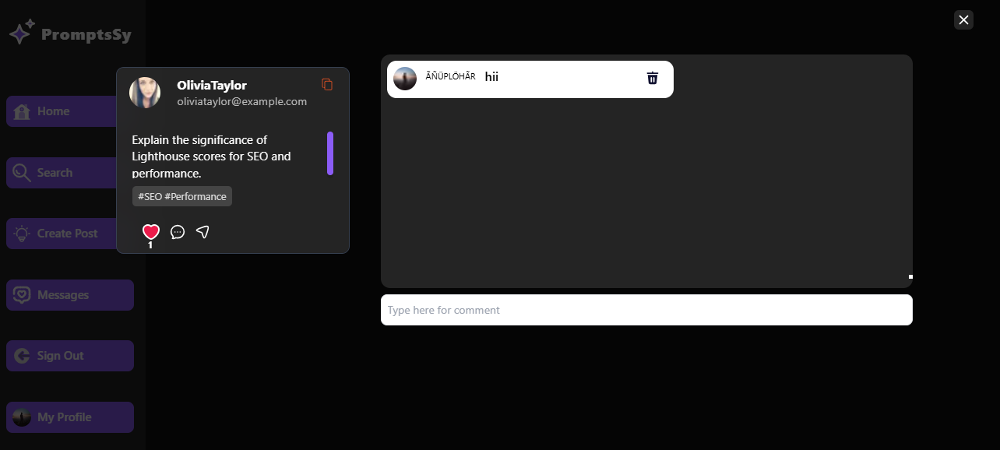

**Responsive Design:** Optimized for devices of all sizes.

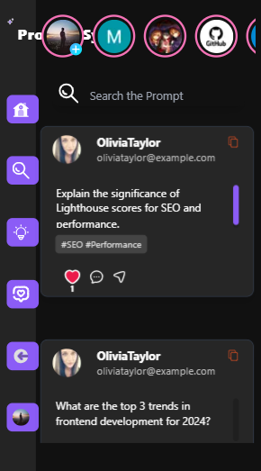

**API Integration:** Built with 30+ API routes for seamless data flow.

## Technologies Used

- **Frontend:**

  - Next.js
  - React.js
  - Tailwind CSS
- **Backend:**

  - Node.js
  - Express.js
  - MongoDB
  - Websockets
- **Others:**

  - Next.js API Routes
  - Git & GitHub for version control

  ## Installation

  Follow these steps to set up and run the PromptsBook project locally:

1. **Clone the Repository**Clone the project from GitHub to your local machine:
   ``git clone https://github.com/Anup-Lohar/promptsbook.git``
2. **Navigate to Project Repository**
   ``cd promptsbook``
3. **Install dependencies**
   ``npm install``
4. **Setup Environment Variables**
   ``MONGODB_URI=your-mongodb-connection-string``
   ``NEXTAUTH_SECRET=your-nextauth-secret``
   ``NEXTAUTH_URL=http://localhost:5000``
5. **Run Development Server**
   ``npm run dev``

### Live Link - https://prompts-book.vercel.app/
